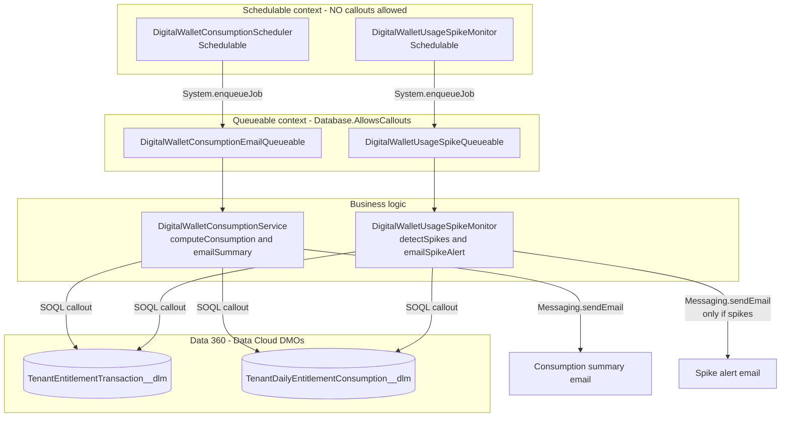
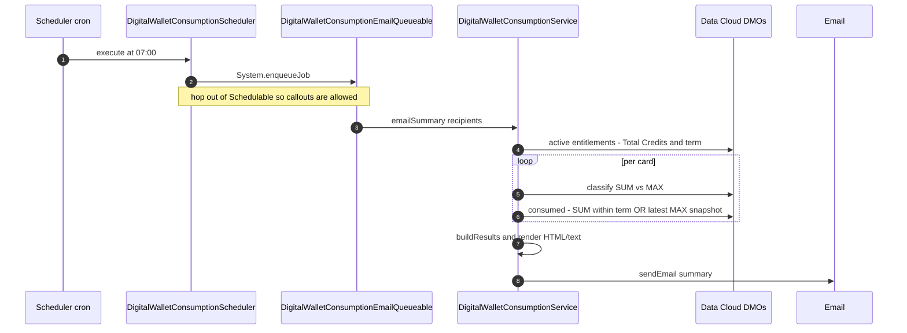

# apex-partner-digital-wallet


Salesforce Apex utilities that reproduce the **Partner Digital Wallet** per‑card
numbers (Total Credits, Consumed, Remaining, % Consumed, % Remaining) directly
from **Data 360 (Data Cloud)** Data Model Objects, email a daily summary, and
raise a day‑over‑day **usage‑spike alert**.

Everything runs on‑platform (no external services). It is designed to be
**ecosystem‑safe** — no hardcoded card names or dates — so you can drop it into
any org that exposes the two source DMOs and start getting daily emails.

> **TL;DR** — Deploy the `force-app` classes, run one anonymous‑Apex line to
> schedule the daily email, and (optionally) schedule the spike monitor. Use the
> files in [`scripts/soql/`](scripts/soql) to verify every number by hand.

---

## Table of contents

- [What it does](#what-it-does)
- [The metrics](#the-metrics)
- [Data model (objects & fields)](#data-model-objects--fields)
- [How it works (architecture)](#how-it-works-architecture)
- [Runtime flow (sequence)](#runtime-flow-sequence)
- [The queries, explained](#the-queries-explained)
- [Repository layout — what each file does](#repository-layout--what-each-file-does)
- [Getting started](#getting-started)
- [Scheduling](#scheduling)
- [Manual verification](#manual-verification)
- [Testing](#testing)
- [Configuration & tuning](#configuration--tuning)
- [Adapting to your org](#adapting-to-your-org)
- [Gotchas & things you might be missing](#gotchas--things-you-might-be-missing)
- [Roadmap ideas](#roadmap-ideas)
- [Contributing](#contributing)
- [License](#license)

---

## What it does

Two independent capabilities, each schedulable to run every morning:

1. **Consumption summary** — computes per‑card Total Credits / Consumed /
   Remaining / % figures and emails a formatted HTML + plain‑text table.
2. **Usage‑spike alert** — for drawdown (SUM‑type) cards, compares the latest
   day's usage against the trailing median of the prior *N* days and emails an
   alert **only when a spike is detected**.

Both read the same two Data Cloud DMOs and share the same "active term window"
logic, but are deliberately decoupled so you can deploy/schedule either one on
its own.

---

## The metrics

For each card that has an **active entitlement** today:

| Metric | Formula |
| --- | --- |
| **Total Credits** | `SUM(quantity__c)` across the card's active entitlement transactions (Add adds, Reduction nets down) |
| **Term window** | `[MIN(startdate__c), MAX(enddate__c))` — half‑open; usage is only counted inside this window |
| **Consumed** (SUM‑type) | `SUM(unitsconsumed__c)` within the term window — cumulative drawdown |
| **Consumed** (MAX‑type) | latest `unitsconsumed__c` snapshot within the term (Production preferred) — point‑in‑time allocation, e.g. storage |
| **Remaining** | `Total Credits − Consumed` |
| **% Consumed** | `100 × Consumed / Total` |
| **% Remaining** | `100 × Remaining / Total` |
| **UNLIMITED** flag | shown when `Total ≥ 1,000,000,000,000` (1e12) |

**Spike detection** (SUM‑type cards only): a card spikes when the latest day is
more than `thresholdPercent` (default **10%**) above the **trailing median** of
the preceding `baselineDays` (default **7**) days. A median — not the prior
single day — is used so one anomalously low or high day doesn't trigger a false
alarm. If the baseline median is zero and today has usage, it's reported as
**"new usage."**

### SUM vs MAX — why two strategies?

Each card's daily rows carry a `usageaggregationtype__c` of either `SUM` or
`MAX`. A card is provisioned as exactly one type:

- **SUM** = incremental daily drawdown → consumed is the **sum** over the term.
- **MAX** = a running snapshot (e.g. storage in use) → consumed is the **latest
  reading**, not a sum (summing snapshots would massively over‑count).

If *any* `MAX` row exists for a card, it is treated as MAX.

---

## Data model (objects & fields)

Both objects are **Data 360 / Data Cloud DMOs** (`__dlm`). They are **read‑only
here** and cannot be created via DML (which is why tests mock them — see
[Testing](#testing)).

### `TenantEntitlementTransaction__dlm` — *entitlements → Total Credits + term*

| Field | Used for |
| --- | --- |
| `entitlementcarddefdevlname__c` | card developer name (the grouping key) |
| `quantity__c` | credits added/removed → `SUM` = Total Credits |
| `startdate__c` / `enddate__c` | term window bounds (`MIN` / `MAX`) |
| `entitlementtransactiontype__c` | filter to `Add` / `Reduction` |
| `entitlementtransactionsubtype__c` | exclude `Reparenting` (avoids double counting) |

### `TenantDailyEntitlementConsumption__dlm` — *daily consumption*

| Field | Used for |
| --- | --- |
| `carddefinitiondevelopername__c` | card developer name (join key) |
| `unitsconsumed__c` | the consumed amount (summed or latest snapshot) |
| `utilizationdate__c` | the usage date (scoped to the term window) |
| `usageaggregationtype__c` | `SUM` vs `MAX` classification |
| `Usage_Business_Environment_Type__c` | prefer `Production` for MAX snapshots |

> ℹ️ **Note:** These Data Cloud DMO field names are standard for Partner Digital
> Wallet. However, Data Cloud versions or configurations may vary. If field
> names differ in your org, see [Adapting to your org](#adapting-to-your-org).

---

## How it works (architecture)

The single most important design fact: **Data Cloud DMO queries are routed by
the platform as outbound callouts, and callouts are blocked in `Schedulable`
context.** So each scheduled job does *no query work itself* — it simply
**enqueues a `Queueable`** that implements `Database.AllowsCallouts`, and the
real query + email happens there.



---

## Runtime flow (sequence)

The daily consumption email, end to end:



The spike path is identical, swapping the monitor/queueable and ending with
"send **only if** one or more spikes were found."

---

## The queries, explained

Every inline SOQL query has a **standalone, copy/paste‑ready twin** (bind
variables replaced with literals) in [`scripts/soql/`](scripts/soql), plus a
mirrored comment block right next to the Apex query. This lets you reproduce any
number by hand in the SOQL runner / Developer Console.

| `.soql` file | Object | Purpose | Binds → literals |
| --- | --- | --- | --- |
| [`digitalWallet_entitlements_active.soql`](scripts/soql/digitalWallet_entitlements_active.soql) | Entitlement | Raw active entitlement rows | none |
| [`digitalWallet_entitlements_totalsAndTerm.soql`](scripts/soql/digitalWallet_entitlements_totalsAndTerm.soql) | Entitlement | Total Credits + `[termStart, termEnd)` per card | none |
| [`digitalWallet_aggregationType.soql`](scripts/soql/digitalWallet_aggregationType.soql) | Daily consumption | SUM vs MAX per card (grouped scan + single‑card probe) | `card` |
| [`digitalWallet_consumption_sum.soql`](scripts/soql/digitalWallet_consumption_sum.soql) | Daily consumption | Consumed for a SUM‑type card | `card`, `tStart`, `tEnd` |
| [`digitalWallet_consumption_maxSnapshot.soql`](scripts/soql/digitalWallet_consumption_maxSnapshot.soql) | Daily consumption | Consumed for a MAX‑type card (Production + fallback) | `card`, `tStart`, `tEnd` |
| [`digitalWallet_recentDailyUsage.soql`](scripts/soql/digitalWallet_recentDailyUsage.soql) | Daily consumption | Recent daily usage feeding spike detection | `card`, `tStart`, `tEnd`, `recentRowLimit` |

**Why aggregate at the source?** Pulling every daily row for a card's term
exceeds the DMO *direct‑assignment* row cap in production (`QueryException:
"Inline query has too many rows for direct assignment"`). So consumption is
`SUM()`‑ed at the source, MAX cards use `ORDER BY ... DESC LIMIT 1`, and the
spike monitor uses a bounded, date‑descending page.

---

## Repository layout — what each file does

```
force-app/main/default/classes/
├─ DigitalWalletConsumptionService.cls        core metrics + email rendering
├─ DigitalWalletConsumptionScheduler.cls      Schedulable → enqueues the email job
├─ DigitalWalletConsumptionEmailQueueable.cls  Queueable (AllowsCallouts) → runs the summary
├─ DigitalWalletUsageSpikeMonitor.cls         Schedulable + spike detection + alert email
├─ DigitalWalletUsageSpikeQueueable.cls        Queueable (AllowsCallouts) → runs the spike alert
└─ *Test.cls                                   unit tests (SoqlStubProvider + @TestVisible seams)

scripts/apex/                                  anonymous Apex you run by hand
├─ DigitalWalletConsumption.apex              one‑shot report to debug logs (aggregate variant)
├─ scheduleDaily.apex                         schedule the daily consumption email
├─ rescheduleDaily.apex                       abort + re‑schedule with a specific cron/timezone
├─ enqueueQueueables.apex                     post‑deploy smoke test (enqueue both jobs now)
└─ hello.apex                                 stock scaffold sample

scripts/soql/                                 standalone, commented SOQL for manual verification
config/project-scratch-def.json              scratch‑org definition
sfdx-project.json                            DX project manifest (API 67.0, default pkg dir)
```

### Class responsibilities

| Class | Type | Responsibility |
| --- | --- | --- |
| `DigitalWalletConsumptionService` | logic | Queries the DMOs, computes per‑card metrics (`computeConsumption`), and builds/sends the summary email (`emailSummary`, `buildSummaryEmail`, HTML/text renderers). Pure result‑shaping lives in `buildResults()`. |
| `DigitalWalletConsumptionScheduler` | `Schedulable` | Cron entry point; enqueues `DigitalWalletConsumptionEmailQueueable`. Helpers: `scheduleDaily()`, `scheduleWith()`. |
| `DigitalWalletConsumptionEmailQueueable` | `Queueable, AllowsCallouts` | Runs `Service.emailSummary(recipients)` where DMO callouts are permitted. |
| `DigitalWalletUsageSpikeMonitor` | `Schedulable` + logic | Self‑contained spike detector (`detectSpikes`, `spikeFor`, `median`, `recentDailyUsage`) and alert email; also enqueues its own Queueable. Tunable via `thresholdPercent` / `baselineDays`. |
| `DigitalWalletUsageSpikeQueueable` | `Queueable, AllowsCallouts` | Runs `Monitor.emailSpikeAlert(recipients, thresholdPct)` in callout‑friendly context. |

---

## Getting started

### Prerequisites

- **Salesforce CLI** (`sf`) — [install guide](https://developer.salesforce.com/docs/atlas.en-us.sfdx_setup.meta/sfdx_setup/sfdx_setup_install_cli.htm)
- A **Salesforce org connected to Data 360 (Data Cloud)** that exposes the two
  DMOs above, and a user with permission to query them.
- **Deliverability** for Apex email set to *All email* (Setup → Email → Deliverability).

### 1. Clone & authorize

```bash
git clone <this-repo-url>
cd apex-partner-digital-wallet
sf org login web --alias dw
```

### 2. Deploy the Apex

```bash
sf project deploy start --source-dir force-app --target-org dw
```

### 3. Smoke‑test right away (no waiting for cron)

```bash
sf apex run --file scripts/apex/enqueueQueueables.apex --target-org dw
```

Then check your inbox and **Setup → Apex Jobs** (or query `AsyncApexJob`).

### 4. See the raw numbers in the debug log

```bash
sf apex run --file scripts/apex/DigitalWalletConsumption.apex --target-org dw
```

---

## Scheduling

Schedule the **daily consumption email** (07:00 org time, to the running user):

```apex
DigitalWalletConsumptionScheduler.scheduleDaily();
// or specific recipients:
DigitalWalletConsumptionScheduler.scheduleDaily(new List<String>{ 'you@example.com' });
```

Schedule the **usage‑spike check** (01:00 org time ≈ 07:00 US Eastern for the
source org's timezone):

```apex
DigitalWalletUsageSpikeMonitor.scheduleDaily();
```

Convenience scripts:

- [`scripts/apex/scheduleDaily.apex`](scripts/apex/scheduleDaily.apex) — schedule the consumption email.
- [`scripts/apex/rescheduleDaily.apex`](scripts/apex/rescheduleDaily.apex) — abort any existing job of the same name and re‑create it with an explicit cron (handy for timezone changes).

> **Timezone note:** `System.schedule` uses the **scheduling user's** timezone.
> Pick your cron accordingly, or use `rescheduleDaily.apex` as a template.

---

## Manual verification

1. Open a file in [`scripts/soql/`](scripts/soql).
2. Read the header comment (it explains the query, filters, and bind→literal
   mapping).
3. For parameterized queries, replace `REPLACE_WITH_CARD_DEVELOPER_NAME` and the
   `tStart` / `tEnd` datetime literals (get those from
   `digitalWallet_entitlements_totalsAndTerm.soql`).
4. In VS Code, select the query text and run **“SFDX: Execute SOQL Query with
   Currently Selected Text.”**

The same standalone SOQL is duplicated as comments beside each inline query in
the Apex classes, so you can cross‑check code ↔ query without leaving the file.

---

## Testing

```bash
sf apex run test --target-org dw --code-coverage --result-format human --wait 10
```

Because DMOs can't be created via DML, tests use two mocking strategies:

- **Typed queries** are mocked with the native **`SoqlStubProvider`** pattern
  (`Test.createSoqlStub` + `Test.createStubQueryRow`).
- **Aggregate queries** (`AggregateResult`, e.g. `SUM`) **can't** be mocked, so
  their values are injected through `@TestVisible` seams
  (`sumConsumedOverride`, `aggTypeOverride`, `consumedOverride`,
  `usageOverride`). Pure comparison/shaping logic (`buildResults`, `spikeFor`,
  `median`) is unit‑tested directly.

Test classes: `DigitalWalletConsumptionServiceTest`,
`DigitalWalletUsageSpikeMonitorTest`, `DigitalWalletConsumptionSchedulerTest`.

---

## Configuration & tuning

| Setting | Where | Default |
| --- | --- | --- |
| Spike threshold (%) | `DigitalWalletUsageSpikeMonitor.thresholdPercent` | `10` |
| Baseline window (days) | `DigitalWalletUsageSpikeMonitor.baselineDays` | `7` |
| Recent rows fetched per card | `DigitalWalletUsageSpikeMonitor.recentRowLimit` | `200` |
| "Unlimited" threshold | `DigitalWalletConsumptionService.UNLIMITED_THRESHOLD` | `1e12` |
| Consumption cron | `DigitalWalletConsumptionScheduler.DEFAULT_CRON` | `0 0 7 * * ?` |
| Spike cron | `DigitalWalletUsageSpikeMonitor.DEFAULT_CRON` | `0 0 1 * * ?` |

Per‑call overrides exist too, e.g. `detectSpikes(15)` or
`emailSpikeAlert(recipients, 15)`.

---

## Adapting to your org

Integration checklist for adopters:

1. **Verify DMO field API names** match your org. These are standard Data Cloud
   fields, but verify the names in [Data model](#data-model-objects--fields)
   match your DMOs. If they differ, search the classes and `scripts/soql/` to
   update field references.
2. **Confirm the transaction type/subtype vocabulary** (`Add`, `Reduction`,
   `Reparenting`) matches your data; adjust the `WHERE` clauses if not.
3. **Confirm the aggregation‑type values** (`SUM` / `MAX`) and the environment
   value (`Production`).
4. Update `sourceApiVersion` in `sfdx-project.json` if you target a different API.

---

## Gotchas & things you might be missing

- **Data Cloud access & callout limits.** DMO SOQL is a callout under the hood.
  Ensure the running user has Data Cloud query permissions, and be mindful of
  callout limits when scaling to many cards.
- **Deliverability must be “All email.”** Otherwise `Messaging.sendEmail` is
  silently suppressed in some org types.
- **Timezone of the scheduling user** drives the cron fire time (see above).
- **Row caps are real.** Don't “simplify” the aggregate queries into
  direct‑assignment row pulls — that's exactly the production failure this design
  avoids.
- **No `LICENSE`, `CONTRIBUTING`, or `CODEOWNERS` file yet** — recommended for a
  public/open‑source repo (see below).
- **No deploy manifest (`manifest/package.xml`)** — deploy currently uses
  `--source-dir force-app`; add a manifest if you prefer manifest‑based deploys.
- **No CI** — consider a GitHub Action that spins up a scratch org and runs the
  Apex tests on PRs.
- **Results aren't persisted.** Output is email + debug log only; there's no
  custom object / Platform Event history. Add one if you want trending or
  dashboards.
- **Config is via static variables**, not Custom Metadata/Settings — fine for a
  POC, but Custom Metadata would let admins tune thresholds without a deploy.
- **Single‑tenant assumption.** The queries assume one tenant's data in scope;
  multi‑tenant filtering would need extra predicates.

---

## Roadmap ideas

- Custom Metadata–driven thresholds, recipients, and field mappings.
- Persist daily results to a custom object + a Lightning dashboard.
- Slack/Chatter notifications alongside email.
- Bulk‑friendly refactor if card counts grow large (batch the per‑card loop).
- GitHub Actions CI (scratch org create → deploy → run tests).

---

## Contributing

Issues and PRs welcome. Please run the Apex tests before submitting and keep the
`scripts/soql/` twins in sync with any query changes so manual verification
stays trustworthy.

## License

No license file is currently included. Until one is added, treat this as
"all rights reserved" by default — **add a `LICENSE`** (e.g. MIT or Apache‑2.0)
before publishing so others can legally reuse it.
